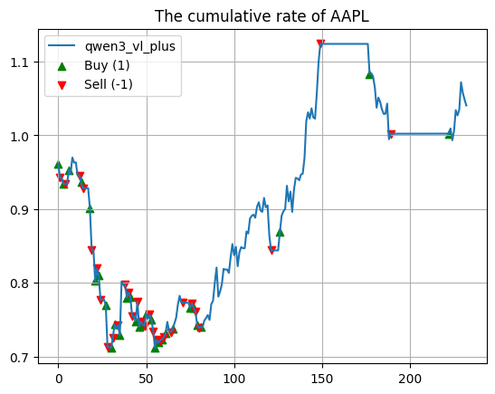

# k-line trader with deepseek-vl
基于deepseek视觉大模型的k线交易员

## 模型下载 1
https://hf-mirror.com/
./hfd.sh deepseek-ai/deepseek-vl2 --local-dir /root/autodl-tmp

## Output (example)

{
        "trading date": "2020-02-03",
        "decision reason": "The total return after all investments has been calculated as 0.0%. The cost rate remains at 0.3%, which means no additional costs have been incurred during this period.",
        "trading decision": -1
}

